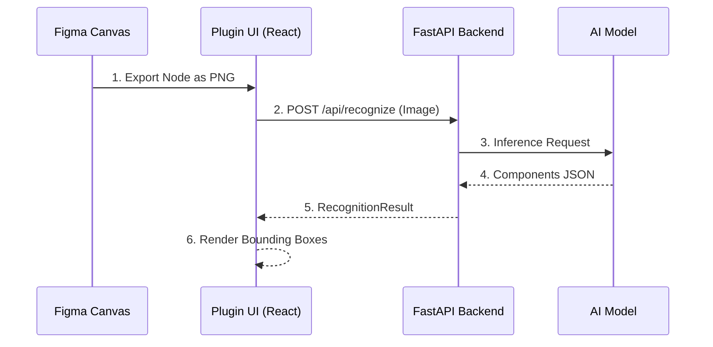

# AGENTS.md

> **Context File for AI Agents**: This document defines the project context, architecture, and rules. Read this first to understand the system.

## 1. Project Overview
**Pichunter** is a Figma Plugin that uses AI to recognize UI components from selected nodes or images.
**Goal**: Automate the identification of UI elements (Buttons, Cards, Inputs) and provide visual feedback/tagging within Figma.

**Core Workflow**:
1.  **Plugin (Frontend)**: Captures node/image -> Sends to Backend.
2.  **Backend**: Receives image -> Calls AI Vision Model -> Returns JSON.
3.  **Plugin (UI)**: Visualizes results (bounding boxes, labels) -> (Future) Draws on Canvas.

## 2. Tech Stack
*   **Frontend**: React + TypeScript + [figma-plugin-ds](https://github.com/thomas-lowry/figma-plugin-ds). Runs in Figma sandbox.
*   **Backend**: Python + FastAPI + Uvicorn.
*   **AI**: OpenAI GPT-4 Vision / Microsoft Florence-2.
*   **Infra**: Local (ngrok) -> Cloud (Vercel/Render).

## 3. Architecture & Data Flow



## 4. Functional Specifications

### Core Features
*   **Image Export**: Auto-export selected Figma nodes (FRAME, GROUP, COMPONENT) to PNG.
*   **AI Recognition**: Identify component type, bounding box (x, y, w, h), and confidence score.
*   **Visualization**: Overlay bounding boxes and labels on the preview image in the plugin UI.
*   **Data Export**: Export recognition results as JSON.

### API Contracts (Simplified)

**POST /api/recognize**
*   Input: `file: UploadFile` (PNG/JPG, max 10MB)
*   Output: `RecognitionResult`

**Domain Models (See `frontend/types.ts` for exact definitions)**
```typescript
// Core entity returned by AI
interface ComponentResult {
  type: ComponentType; // 'button' | 'input' | 'card' | ...
  confidence: number;  // 0.0 - 1.0
  bbox: { x: number; y: number; width: number; height: number };
  label: string;
}

// API Response Wrapper
interface RecognitionResult {
  components: ComponentResult[];
  metadata: { processing_time: number; model: string };
}
```

## 5. Project Structure
```text
/
├── specs/             # Documentation & Context (AGENTS.md, tasks.md)
├── src/               # Plugin Source (code.ts, ui.html)
├── frontend/          # React UI App (Vite/Webpack)
├── backend/           # Python FastAPI App
├── dist/              # Compiled Plugin Code
└── manifest.json      # Figma Manifest
```

## 6. Development Guidelines

### Code Style
*   **TS/React**: Strict mode, Functional Components, Hooks, Single quotes.
*   **Python**: PEP8, Type hints (Pydantic models).
*   **General**: Modular design (UI vs Logic vs API).

### Python Code Standards

#### Type Annotations (类型注解规范)
**所有代码必须包含类型注解（强制要求）**

**1. 类属性声明：**
```python
from typing import Optional, List

class GeminiService:
    # 必须声明属性类型（类似 Swift）
    api_key: Optional[str]
    model: Optional[genai.GenerativeModel]
    config: dict
    
    def __init__(self) -> None:
        self.api_key = os.environ.get("GEMINI_API_KEY")
        self.model = None
```

**2. 函数签名：**
```python
# 所有参数和返回值都要类型注解
def process_image(
    image: Image.Image,
    size: int = 100
) -> bytes:
    pass

# 异步函数也要注解
async def recognize_components(
    self,
    image: Image.Image
) -> List[ComponentResult]:
    pass
```

**3. 常用类型：**
```python
from typing import List, Dict, Optional, Union, Tuple, Any

# 列表
users: List[User] = []

# 字典
config: Dict[str, str] = {}

# 可选（可能为 None）
result: Optional[User] = None

# 联合类型（多种可能）
data: Union[str, int] = "hello"

# 元组
coords: Tuple[int, int] = (10, 20)

# 任意类型（尽量避免）
value: Any = something
```

**4. 文档字符串：**
```python
def recognize_components(
    self,
    image: Image.Image
) -> List[ComponentResult]:
    """
    识别图片中的 UI 组件
    
    Args:
        image: PIL Image 对象（已验证）
        
    Returns:
        ComponentResult 列表，包含所有识别出的组件
        
    Raises:
        ValueError: 如果 API Key 未配置
        Exception: 如果 AI 调用失败
    """
    pass
```

#### File Organization (All Python Files)
1.  **Imports** (grouped and ordered):
    *   Standard library
    *   Third-party libraries
    *   Local modules
2.  **Module-level constants** (UPPER_CASE)
3.  **Class definitions** (ordered by dependency)
4.  **Function definitions**

#### schemas.py Structure
**Class order (bottom-up dependency):**
1.  Base classes (`ErrorDetail`, `HealthResponse`)
2.  Atomic models (`BoundingBox`, `ImageInfo`, `ComponentResult`)
3.  Aggregate models (`RecognitionMetadata`, `RecognitionResult`)
4.  API wrappers (`RecognitionResponse`)

**Add section comments:**
```python
# ============================================
# 通用基础类
# ============================================
```

#### main.py Structure
**File order:**
1.  Imports (standard → third-party → local)
2.  Configuration constants (`MAX_IMAGE_SIZE_BYTES`)
3.  App initialization (`app = FastAPI(...)` + middleware)
4.  Route endpoints (grouped by feature)

**Add section comments:**
```python
# ============================================
# 配置常量
# ============================================
```

#### Naming Conventions
*   **Constants**: `UPPER_SNAKE_CASE`
*   **Classes**: `PascalCase`
*   **Functions/Variables**: `lower_snake_case`
*   **Private**: `_leading_underscore`

#### String Literals
**Avoid magic strings - extract to constants:**
```python
# ❌ Bad: Hard-coded strings
service="pichunter-backend"

# ✅ Good: Extract to constants
SERVICE_NAME = "Pichunter Backend"
service=SERVICE_NAME
```

**When to extract:**
*   Reused multiple times
*   May change in the future
*   Has business meaning

### Agent Rules (Interaction Protocol)
1.  **Context First**: Always check `AGENTS.md` and `specs/tasks.md` before starting.
2.  **Incremental Changes**: Break large features into: Types -> Backend API -> Frontend Logic -> UI.
3.  **No Assumptions**: If API contracts or UI designs are ambiguous, ask the user.
4.  **Safety**:
    *   Plugin UI cannot access DOM directly (use `postMessage`).
    *   Handle large images and network timeouts gracefully.
    *   Do not commit secrets (API Keys).

## 7. Setup Commands
```bash
# Backend
cd backend && python -m venv .venv && source .venv/bin/activate
pip install -r requirements.txt
uvicorn app.main:app --reload --port 8000

# Frontend
cd frontend && npm install && npm run dev

# Plugin Build
npm run watch:plugin
```