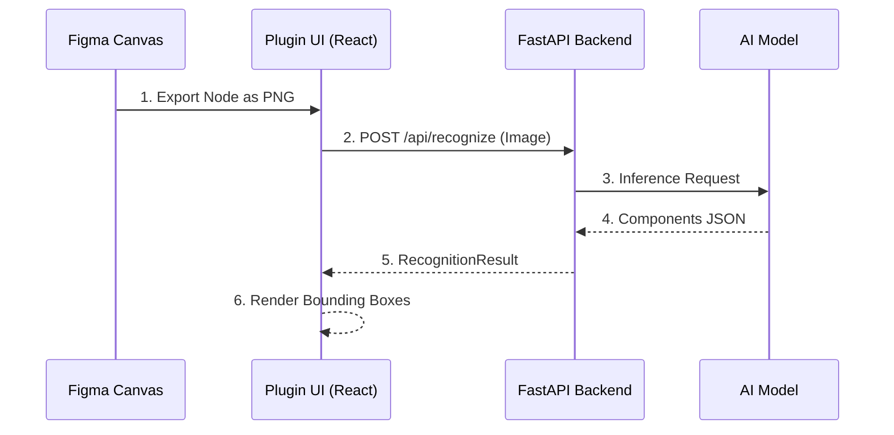

# AGENTS.md

> **Context File for AI Agents**: This document defines the project context, architecture, and rules. Read this first to understand the system.

## 1. Project Overview
**Pichunter** is a Figma Plugin that uses AI to recognize UI components from selected nodes or images.
**Goal**: Automate the identification of UI elements (Buttons, Cards, Inputs) and provide visual feedback/tagging within Figma.

**Core Workflow**:
1.  **Plugin (Frontend)**: Captures node/image -> Sends to Backend.
2.  **Backend**: Receives image -> Calls AI Vision Model -> Returns JSON.
3.  **Plugin (UI)**: Visualizes results (bounding boxes, labels) -> (Future) Draws on Canvas.

## 2. Tech Stack
*   **Frontend**: React + TypeScript + [figma-plugin-ds](https://github.com/thomas-lowry/figma-plugin-ds). Runs in Figma sandbox.
*   **Backend**: Python + FastAPI + Uvicorn.
*   **AI**: OpenAI GPT-4 Vision / Microsoft Florence-2.
*   **Infra**: Local (ngrok) -> Cloud (Vercel/Render).

## 3. Architecture & Data Flow



## 4. Functional Specifications

### Core Features
*   **Image Export**: Auto-export selected Figma nodes (FRAME, GROUP, COMPONENT) to PNG.
*   **AI Recognition**: Identify component type, bounding box (x, y, w, h), and confidence score.
*   **Visualization**: Overlay bounding boxes and labels on the preview image in the plugin UI.
*   **Data Export**: Export recognition results as JSON.

### API Contracts (Simplified)

**POST /api/recognize**
*   Input: `file: UploadFile` (PNG/JPG, max 10MB)
*   Output: `RecognitionResult`

**Domain Models (See `frontend/types.ts` for exact definitions)**
```typescript
// Core entity returned by AI
interface ComponentResult {
  type: ComponentType; // 'button' | 'input' | 'card' | ...
  confidence: number;  // 0.0 - 1.0
  bbox: { x: number; y: number; width: number; height: number };
  label: string;
}

// API Response Wrapper
interface RecognitionResult {
  components: ComponentResult[];
  metadata: { processing_time: number; model: string };
}
```

## 5. Project Structure
```text
/
├── specs/             # Documentation & Context (AGENTS.md, tasks.md)
├── src/               # Plugin Source (code.ts, ui.html)
├── frontend/          # React UI App (Vite/Webpack)
├── backend/           # Python FastAPI App
├── dist/              # Compiled Plugin Code
└── manifest.json      # Figma Manifest
```

## 6. Development Guidelines

### Code Style
*   **TS/React**: Strict mode, Functional Components, Hooks, Single quotes.
*   **Python**: PEP8, Type hints (Pydantic models).
*   **General**: Modular design (UI vs Logic vs API).

### Agent Rules (Interaction Protocol)
1.  **Context First**: Always check `AGENTS.md` and `specs/tasks.md` before starting.
2.  **Incremental Changes**: Break large features into: Types -> Backend API -> Frontend Logic -> UI.
3.  **No Assumptions**: If API contracts or UI designs are ambiguous, ask the user.
4.  **Safety**:
    *   Plugin UI cannot access DOM directly (use `postMessage`).
    *   Handle large images and network timeouts gracefully.
    *   Do not commit secrets (API Keys).

## 7. Setup Commands
```bash
# Backend
cd backend && python -m venv .venv && source .venv/bin/activate
pip install -r requirements.txt
uvicorn app.main:app --reload --port 8000

# Frontend
cd frontend && npm install && npm run dev

# Plugin Build
npm run watch:plugin
```